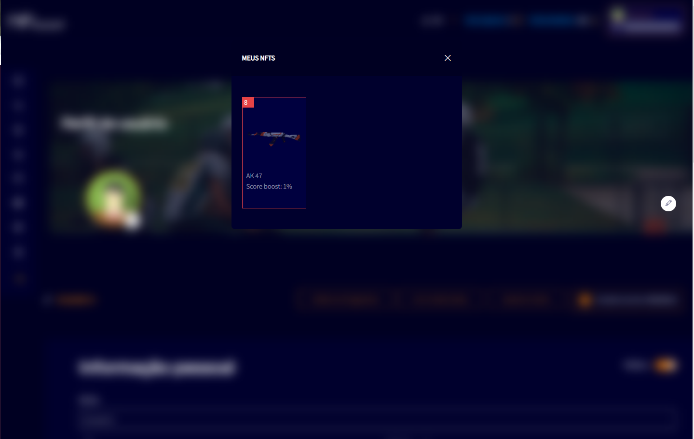
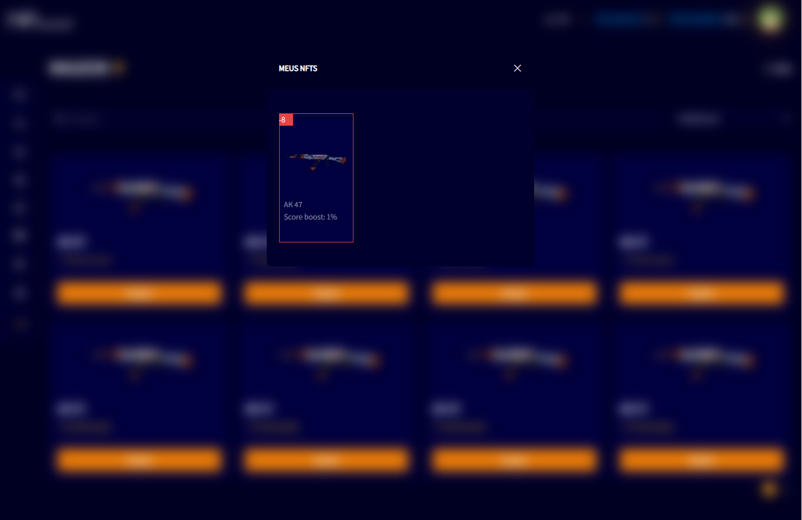

# NFT UPDATES

If there is any inventory update with the user's NFT items, a modal will be displayed referring to the NFT update in the platform's databases.

This modal can be displayed in different parts of the application on the NFboost website, for example:

- Edit profile page

- Select items to equip NFT

