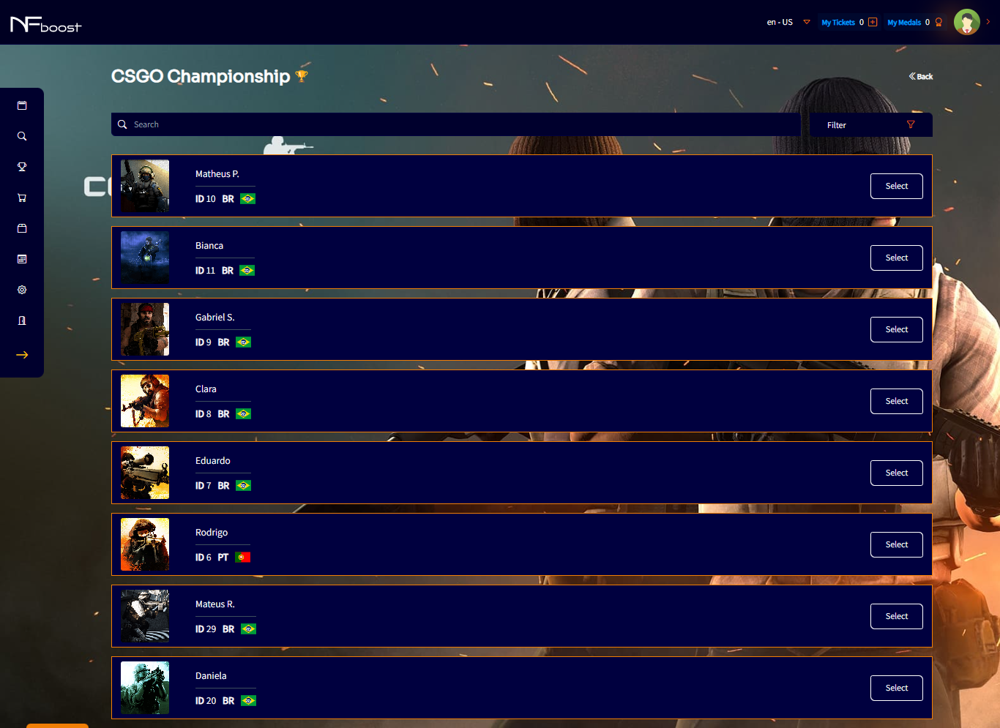
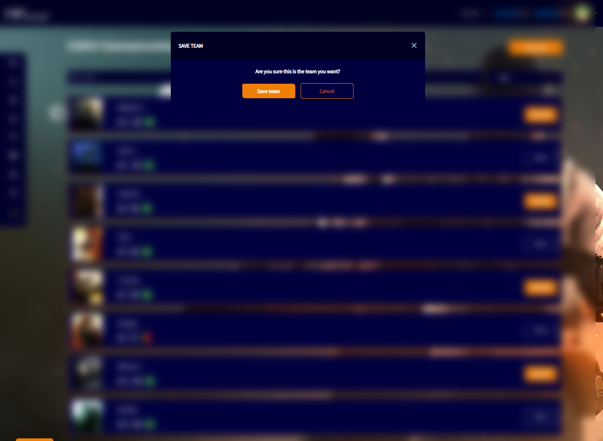
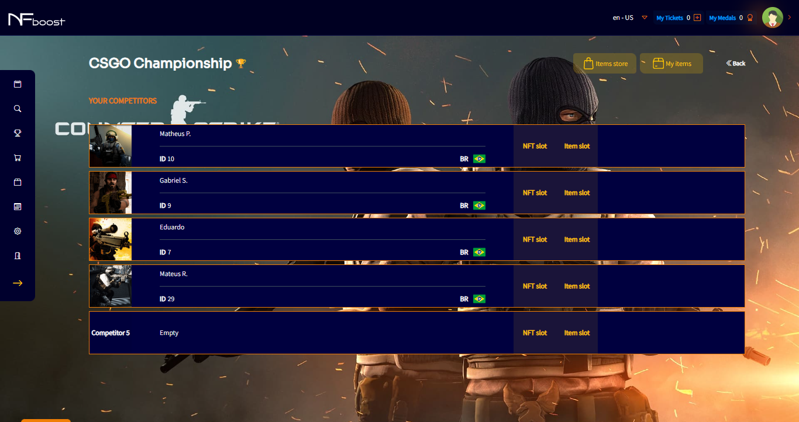

# EDIT TEAM

Within the event in which the user chose to participate, they will have the option to choose up to 5 players to compose their team, assigning them items purchased on the market or not.

After choosing the players to participate in the event, the user will not be able to make changes to these players, choosing others to play in their place, for example.

The only permission that the user will have to equip or not their players with the items they bought in the market, if they choose to enter the event in a paid way.

