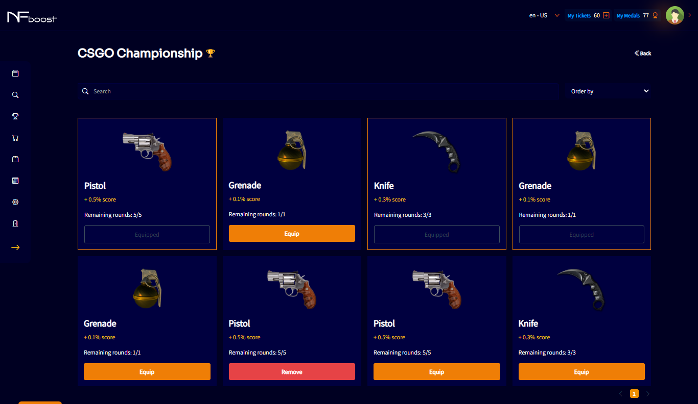
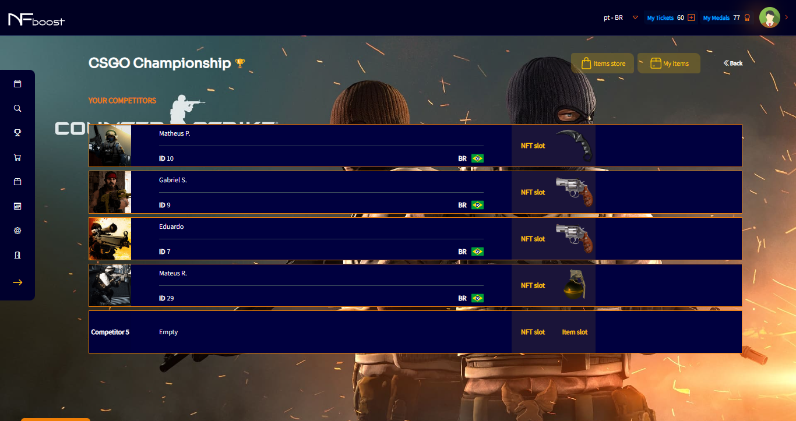

# EQUIP TEAM

After editing the team, will be able to equip NFTs or items in team's competitors that were purchased on the “Marketplace” screen.

To do this, the user just clicks the slot corresponding to the competitor and decides whether to equip an NFT or Item. It will then be redirected to a screen to equip.

The NFTs or Items may be removed and/or edited at any time by the user.

The durability of an NFT is permanent, that is, while the event is active, the user can equip or unequip the NFT in the team as many times as they want.
