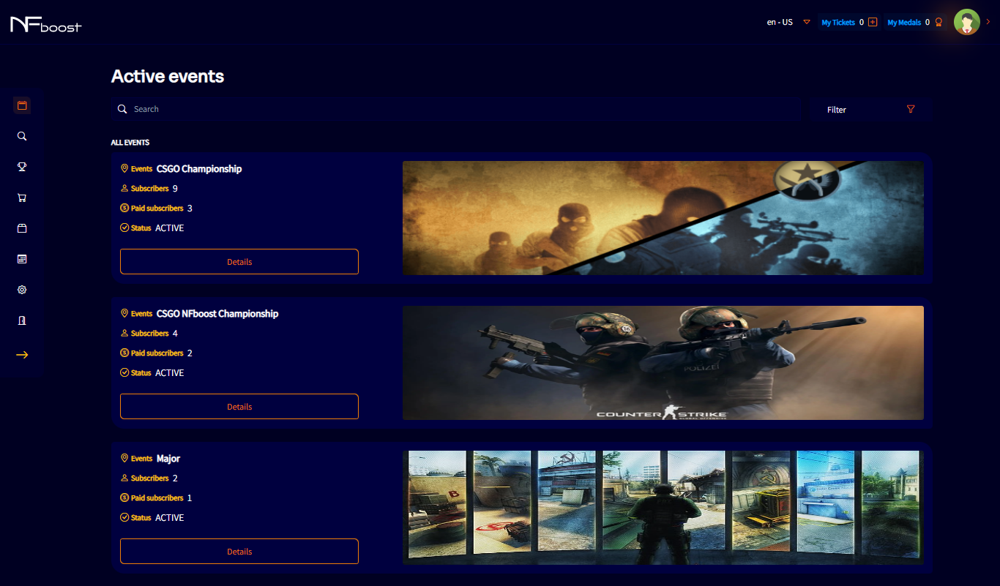
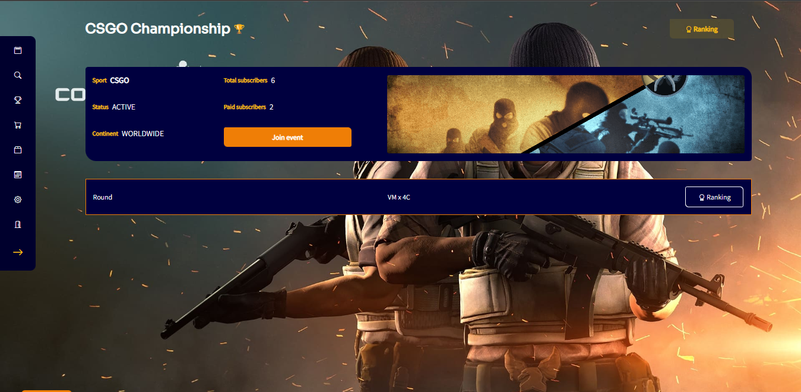
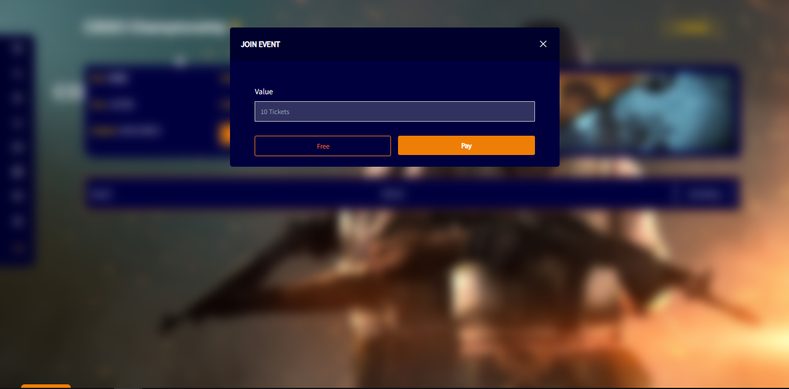

--- 
sidebar_position: 1
---

# PARTICIPATE IN AN EVENT

On the home screen, there will be all active events for the user to choose from among those available to participate and also to search using the filter bar typing.

Entering a certain event, the user will be able to identify the details of the event, how many people are participating, paid or free, the continent from which the event will be available for other users to participate and how many rounds have already been contested.

The user can participate in as many events as they want, entering for free or paid.

Participating for free, the user will not receive any medal at the end of each round. Medals are “credits” to buy items in the market to equip your team and get extra scores in events. These credits are earned based on the team's score in each round.

If the user chooses to participate in a paid way, they will spend 10 tickets from the total available for the purchase of the packages they chose in the "My tickets" menu, in addition to, at the end of each round, winning medals based on the round score.

