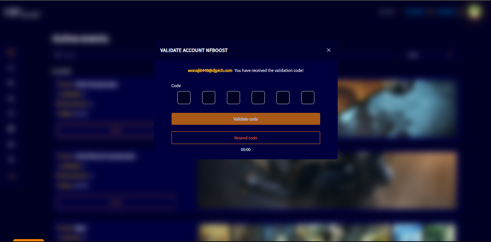

# AUTHENTICATION

Before the user can browse the site, they need to authenticate the account with a six-digit code that were sent to the email or cell phone, from which were registered on the site.

When the user authenticates the account, a warning will be displayed, informing the user that they will be logged out of the account to login again and choose their preferences.

