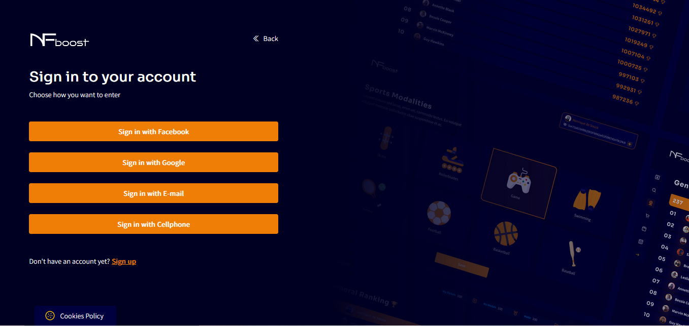

# FORGOT PASSWORD

If any time the user forgets the login password on the NFboost website, just click “Forgot your password?” and a screen will be redirected to choose the best way to recover the password with email or phone number.

Choosing to recover the access password by cell phone number, for example, the user will inform the phone number.

First part: A code will be sent to the cell phone.

Second part: After approval of the code, you will be able to create a new access password.

After creating a new access password, the user will return to the login screen, where they will fill in with email or phone number and the new password.

