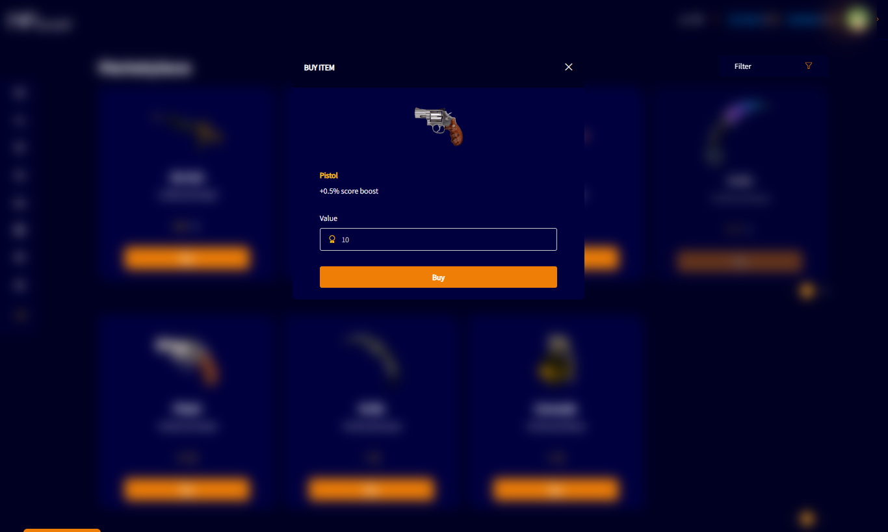

# BUY ITEM

If the user wants to buy a pistol item to equip their team for example, they will spend ten medals from the total that are available. Observation, the medals they will earn only if they participate in events in a paid way, otherwise, it will not be possible to buy any item in the market.

After purchasing the item, it will be visible in "My Items" menu.
