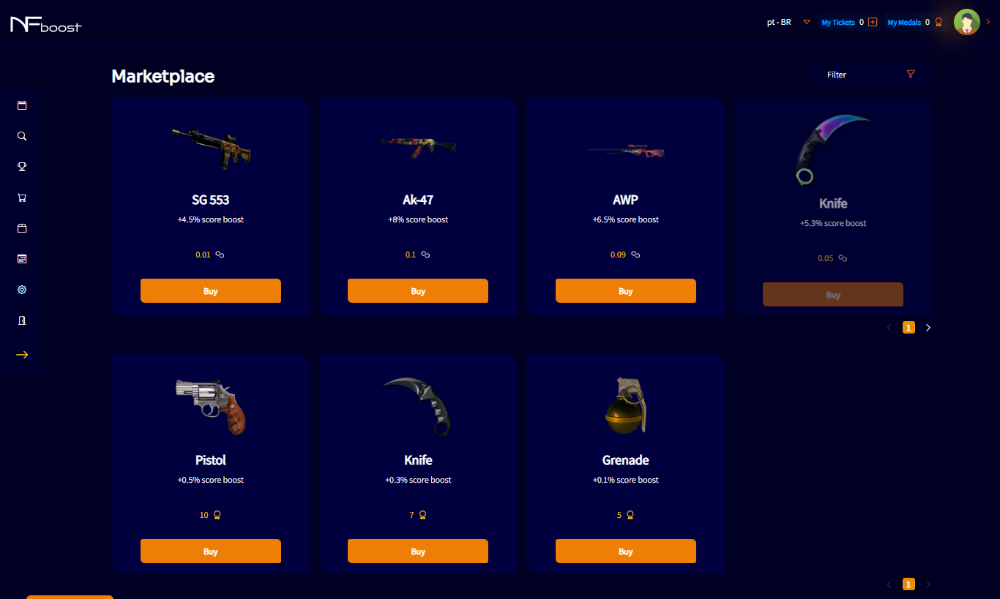

# MARKETPLACE

In the left corner of the screen will be the Marketplace button. In this environment, items and NFTs will be available for the user to equip the team and generate extra scores in the events that they is participating or wants to participate.

Each item, or NFT, has a different cost, durability, or score bonus. Items or NFTs unavailable for purchase, means that the available quantity has already been old.

Items or NFTs unavailable for purchase, means that the amount available for sale in the marketplace has already reached the limit.
