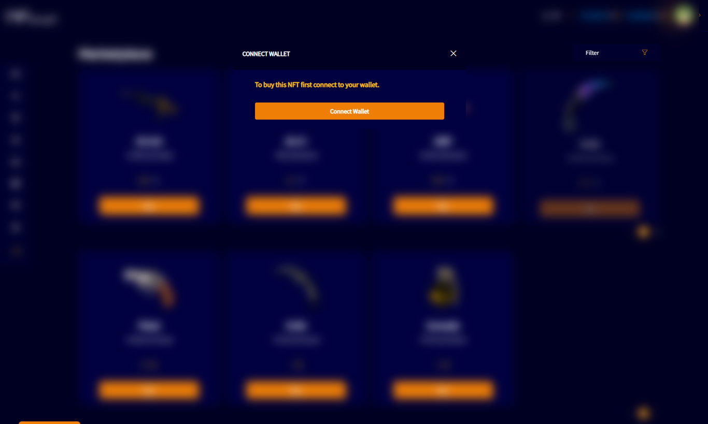
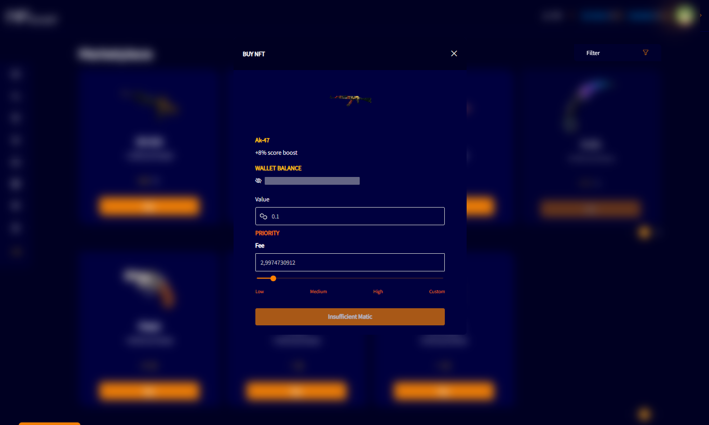

# BUY NFT

If the user wants to buy an NFT in the market, they will need to connect a wallet.

If the user has a wallet connected to the account, a screen with details for the NFT purchase will be displayed.

After purchasing the NFT, it will be visible in "My Items" menu.
