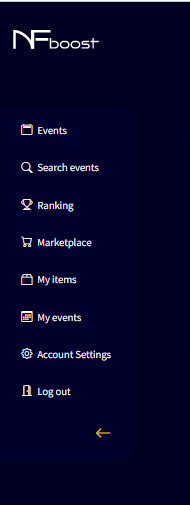

# SIDE MENU TAB

- Events: Displays active events on the site.

- Search Events: search for events on the site through the search bar.

- Ranking: Displays the ranking of all events that the user is participating in and their individual ranking.

- Marketplace: Place to purchase items through medals that the user won in the round during the events in which they are participating and NFTs if the user has a wallet connected to NFboost. Medals are only earned if the user participates in a paid event.

- My Items: Displays the items and quantity of each to equip in the user's event team.

- My Events: Displays the active events the user is participating in.

- Account Settings: Displays user's accounts settings.

- Logout: The user logs out of the site.

