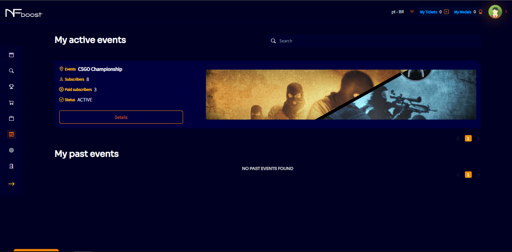
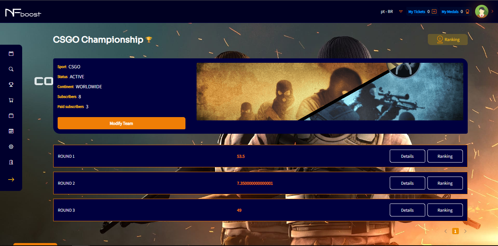

# ACTIVE EVENTS

In the side menu, “My Events”, the user will be able to check the events he is participating in at the moment and past events.

By clicking on one of the active events, the user will be able to obtain details of that event, such as round details: where it will show the score of the players in the team, the general score and the position in the ranking among the users who are participating in this same event.

