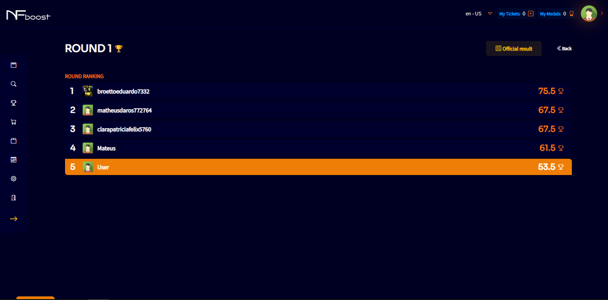
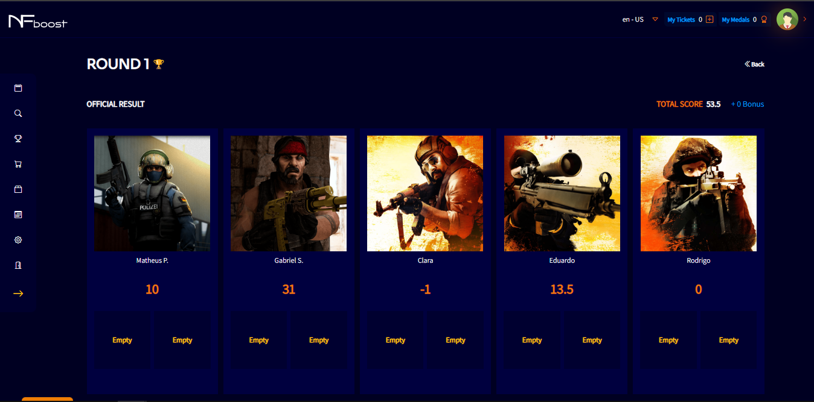

# ACTIVE EVENTS

In the side menu, “My Events”, the user will be able to check the events he is participating in at the moment and past events.

By clicking on one of the active events, the user will be able to obtain details of that event, such as round details: where it will show the score of the players in the team, the general score and the position in the ranking among the users who are participating in this same event.

In the “Details” button, it displays a modal with the details of the players in the round.

By clicking on a specific player, the user will obtain some information about the competitor who participates or participated in the same event as him. Information such as event score, rounds played, average score, are some of the details that the user will have.

The “Ranking” button next to the “Details” button displays a modal with the ranking of users who are participating in the event at that moment.

At the end of each round, an “Official Results” screen will be available with the final score of the team in the round.

