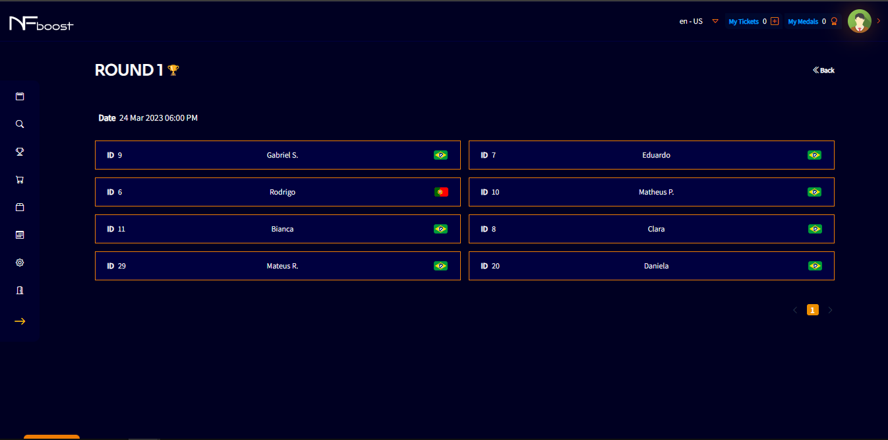
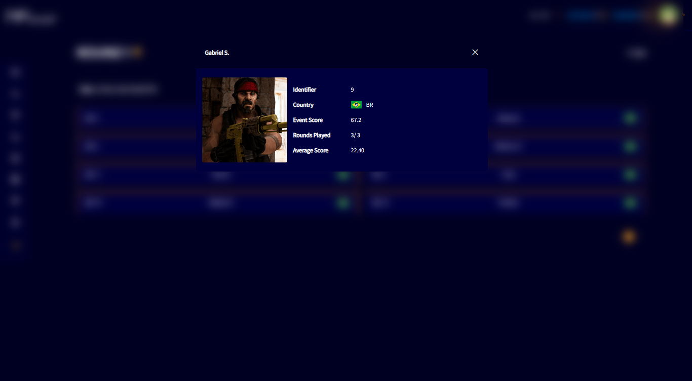
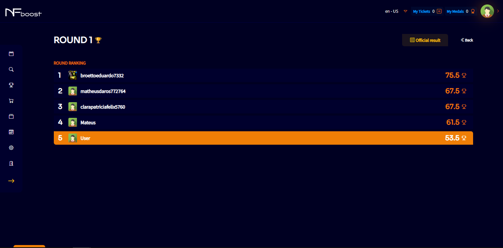
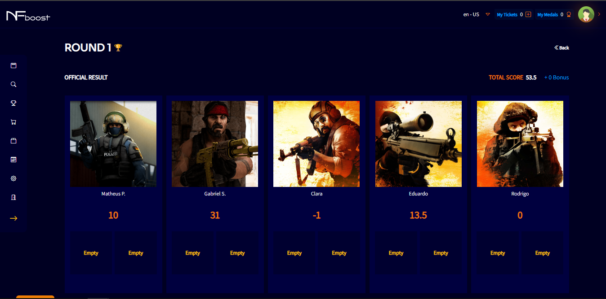
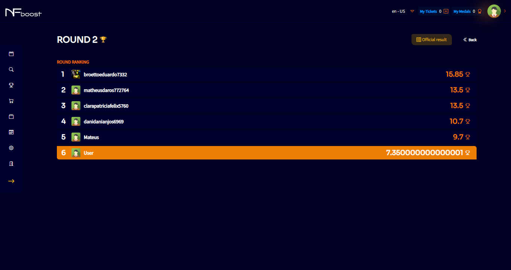
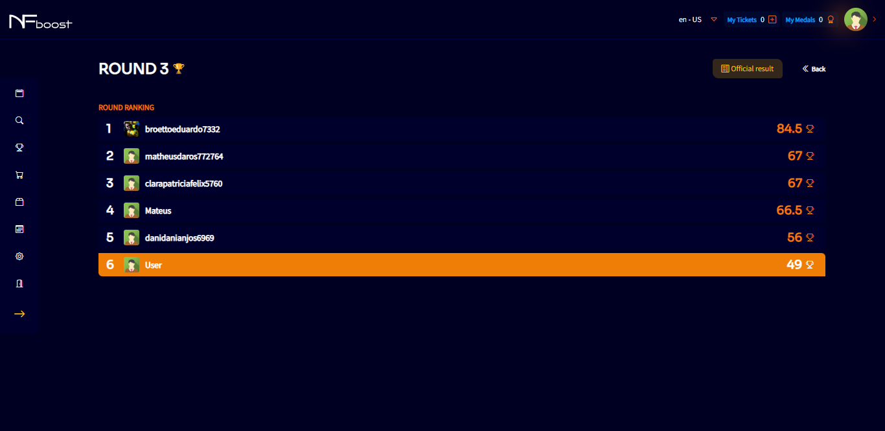

# RANKING

Participating in a certain event, that event can have numerous rounds with the results of each competitor that participated in that event.

In the “Details” button, it displays a screen with details of the players in the round.

By clicking on a specific player, the user will obtain some information about the competitor who participates or participated in the same event as them. Information such as event score, rounds played, average score, are some of the details that the user will have.

The “Ranking” button next to the “Details” button displays a screen with the ranking of users who are participating in the event at the moment.

At the end of each round, an “Official Results” screen will be available with the final score of the team in the round.

The score of all rounds that have taken place so far can be displayed to the user in "General Ranking" menu.