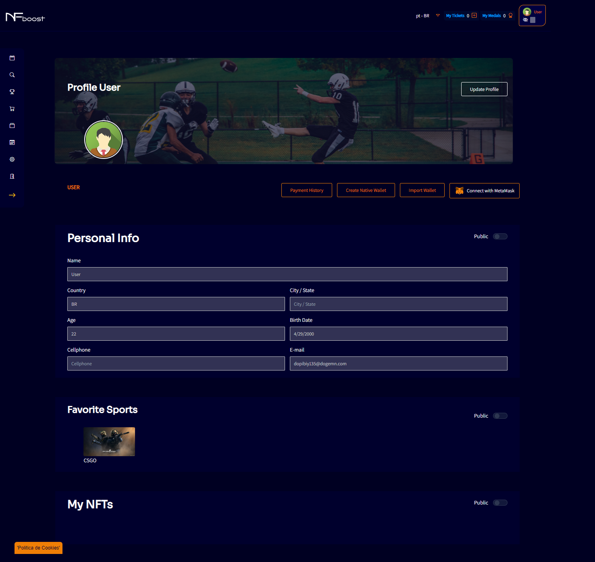

# ACCESS PROFILE

In the upper right corner, where the profile icon is located, there is a button that redirects the user to the "My profile" screen. On this screen, the user's information will be displayed, which they will be able to edit and leave some public or private information.

