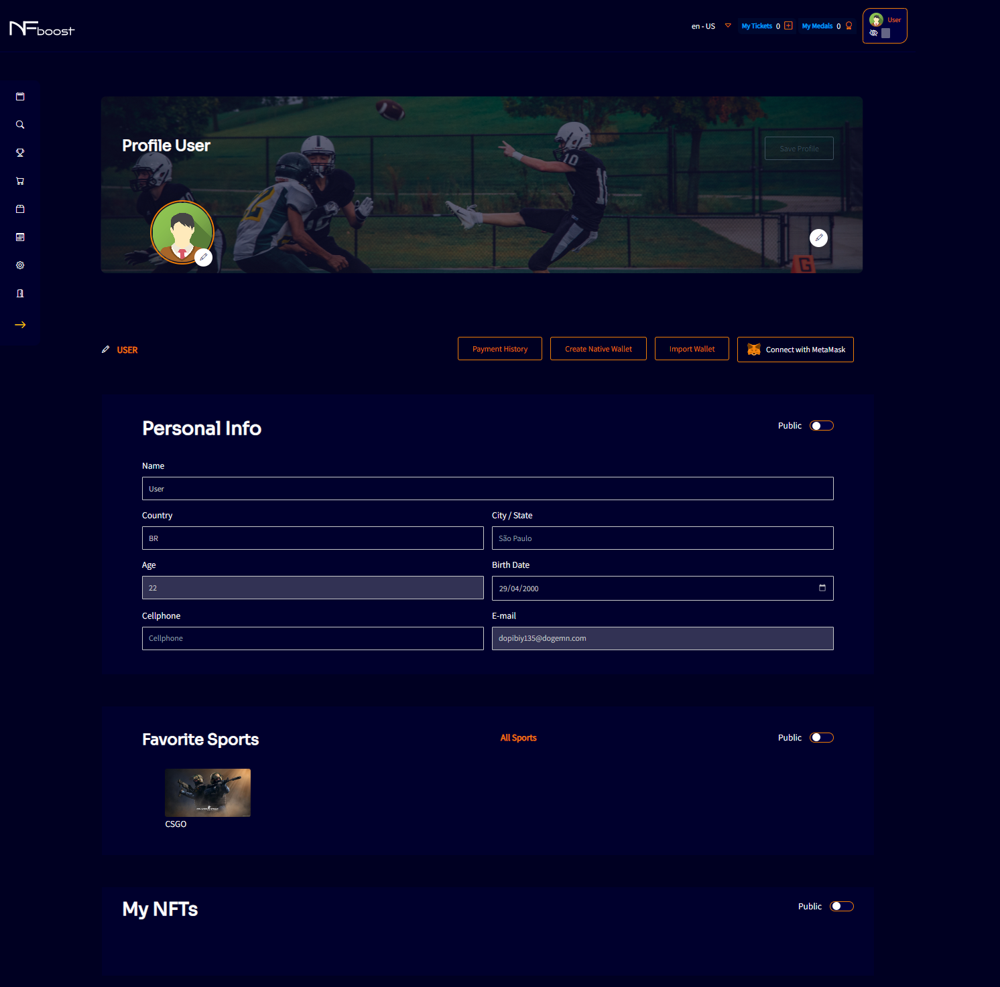
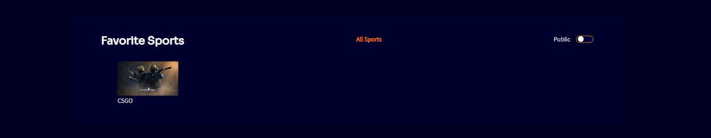
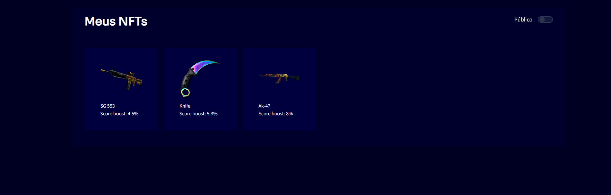
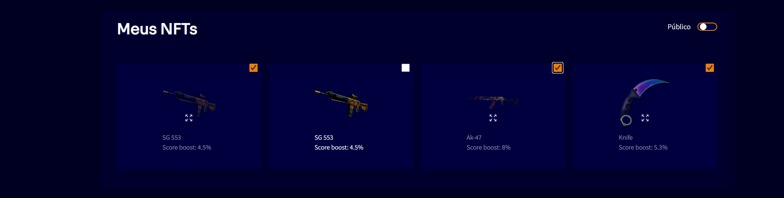

# EDIT PROFILE

Above the profile cover there will be a profile editing button, this means that the user will be able to edit the date of birth, country and city where they lives, choose a profile picture and/or a cover, for example.

The user can keep their profile information private or public, just click on the “Public” option in the right corner below the profile to activate or deactivate it.

Editing the user's favorite sports is also done on this screen.

By clicking on the "All Sports" button, the user will be redirected to a screen from which they will have the option of choosing to remove or add a sport. The sport privacy option is at the discretion of the user.

If the user has any purchases of NFTs, it will also appear there.

It is possible to choose which NFTs can be displayed on the profile screen by the user. Being the display of them publicly or privately.

