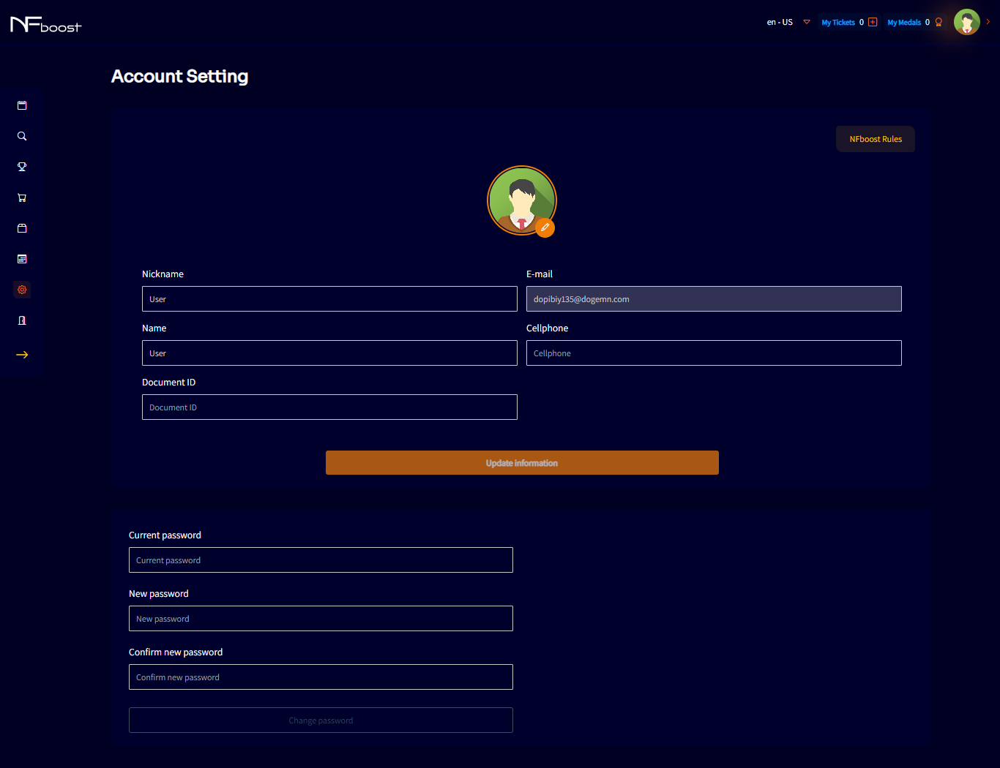

# ACCOUNT SETTINGS

In the left corner of the screen will be the menu with the "account settings" button. On this screen, the user will be able to create a nickname for his account, add information such as a cell phone number and a document address.

It will also be possible to create a new access password for the account, if the user wishes.

