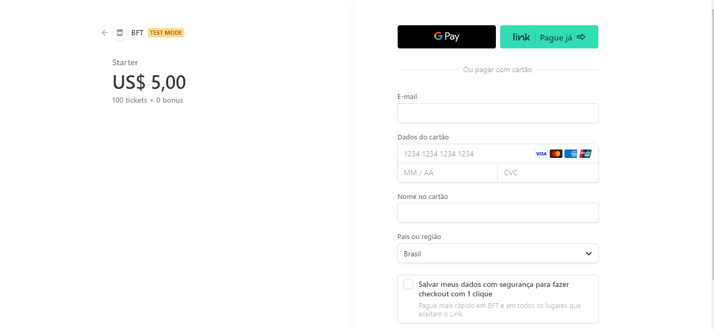

# BUY TICKETS

If the user wants to buy a starter package with 100 tickets, for example, as soon as they selects the option, they will be redirected to a payment screen outside the application in the stripe.

With this, the user will enter the card data and confirm the purchase.

After confirming the purchase, they will be redirected to the home screen, with the purchased package already added to the “My Tickets” menu.
