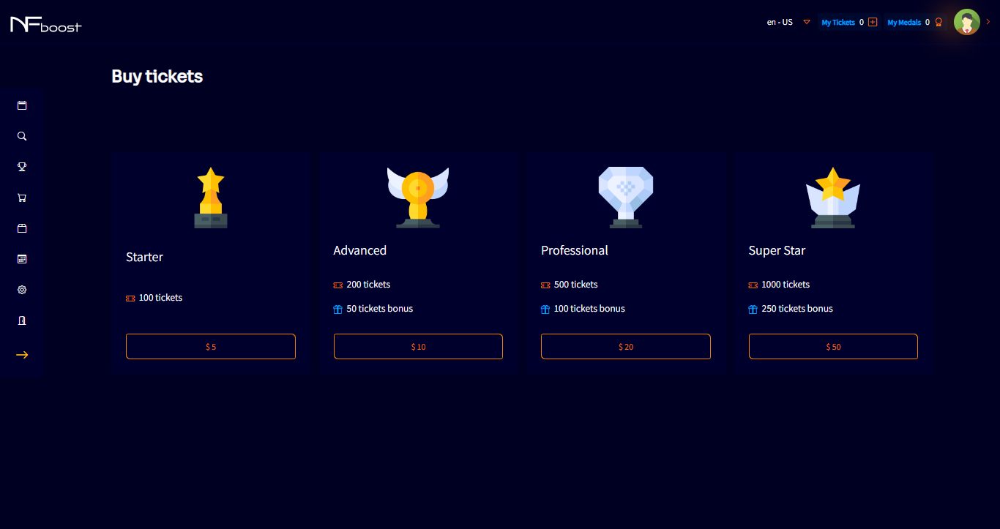

# MY TICKETS

In the home screen, “My Tickets” tab there is the number of tickets that the user has on the platform will be available.

The user will be able to buy as many packages of tickets as they want based on the packages available for purchase.

The purchase of packages with tickets will allow the user to win medals at the end of each round of the events in which they participate in a paid way, where they can later go to the market and buy items to equip their team in the event.

