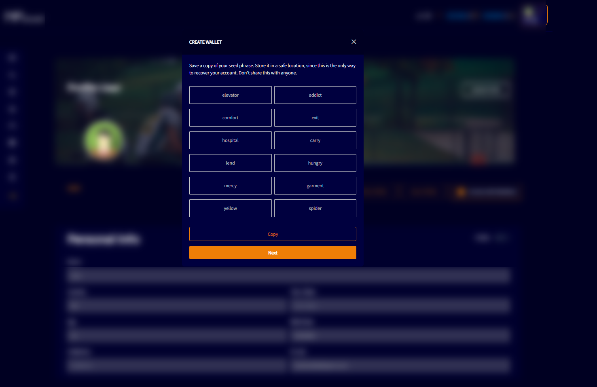

--- 
sidebar_position: 2
---

# CREATE WALLET

In “My Profile” or “Profile Edit” there is a button for the user create a wallet

Clicking “Create Native Wallet” option will open a screen with 12 keywords, and the user needs to copy and save these words on their device.

After copying these 12 words, the user can click “Next” button where they will be redirected to a screen, from which they will need to paste the 12 words that they copied in the previous process and create an access password.

After that, the wallet will be created and the user will have access to it.
