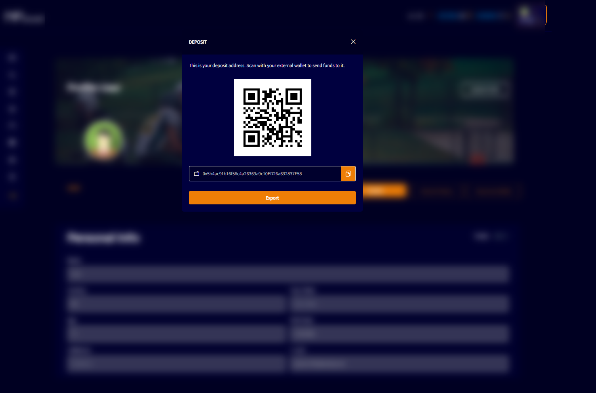

# DEPOSIT

In the top right corner of “My Profile” screen, there is an item with an “eye” that shows how much coin the user has in their wallet. The user can click in the “eye” to show the amount, or click again to hide the amount. 

Besides the eye, there is a “plus” (+) when the user clicks “+”, will appear a modal with QR code that can be scanned directly from a bank account app and a code that can be copy and paste in a bank account app, if they have a wallet connected in another directory, can send funds moving the wallet within the NFboost platform.

