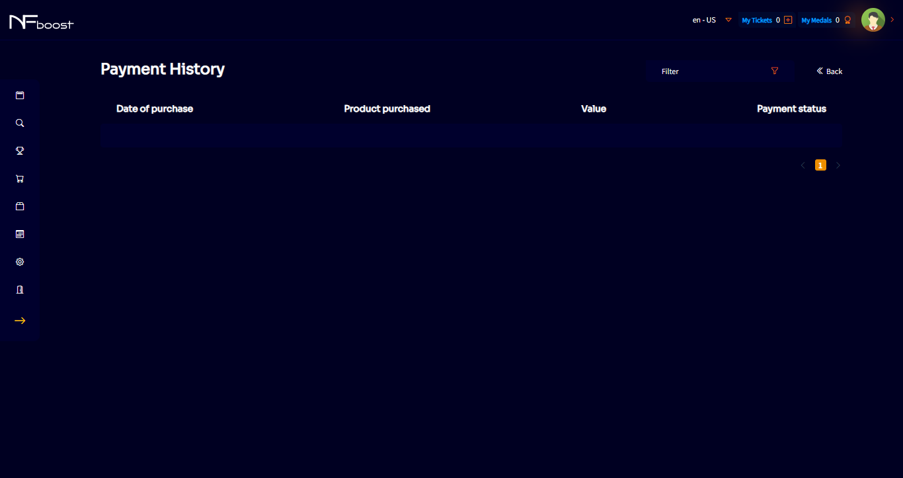

# PAYMENT HISTORY

In “My Profile” menu, the button with the user's payment history is indicated, if they have made a purchase, with all the information such as the date of purchase, the product that was purchased, the amount and payment status.

