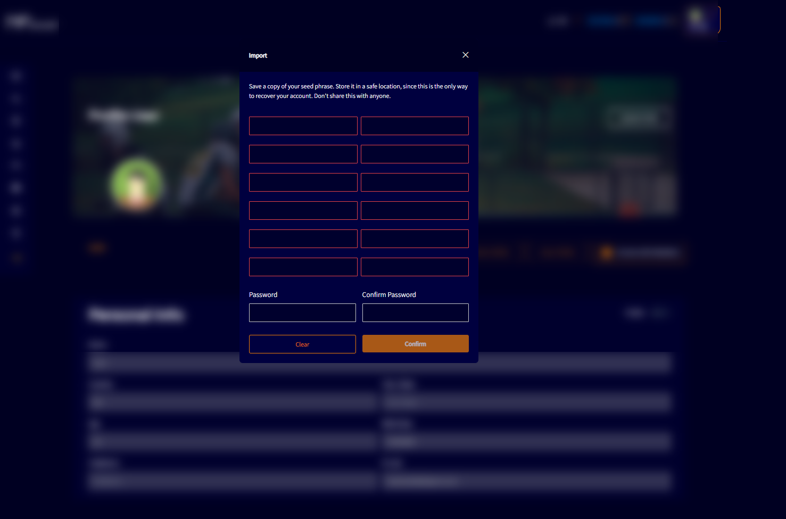

# IMPORT WALLET

The “Import Wallet” option shows a button for the user import a wallet to the NFboost website.

Clicking on this option will open a modal with a tab for the user to fill in with 12 words and an access password.

If the user has created a wallet on some other server or website, for example, they must paste the 12 words and the access password, as the blockchain system is the same for all.

After that, the wallet will be imported and the user will have access to it.
