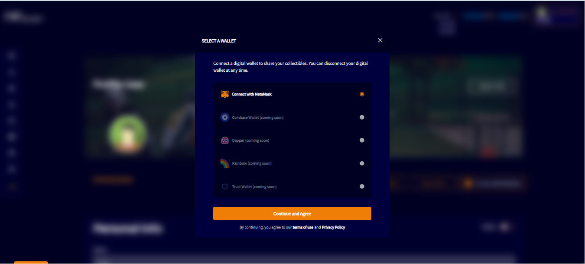
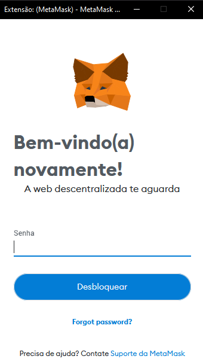
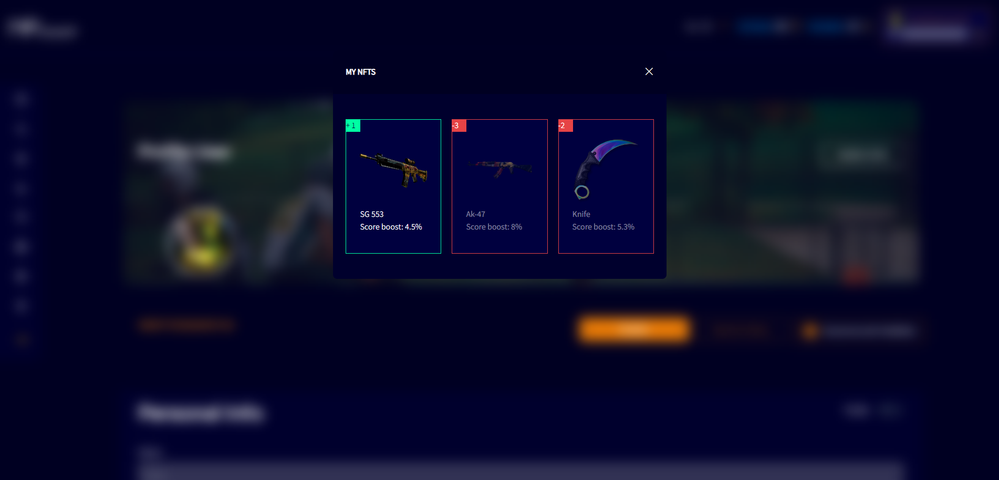

# CONNECT WALLET

If the user has a MetaMask wallet, they can import it to the NFboost website. Just click on the option of “Connect with MetaMask”. Click on the “Connect and agree” option.

If the user has a MetaMask extension installed in the browser, a pop-up screen will open to enter the login and access password.

After entering the password in MetaMask, the account will be connected. When connecting to the wallet, if the user has an NFT, a screen will be displayed with all the NFT items connected to the wallet.

After that, the NFTs will be available for viewing in "My Profile" and "My Items" screen.
